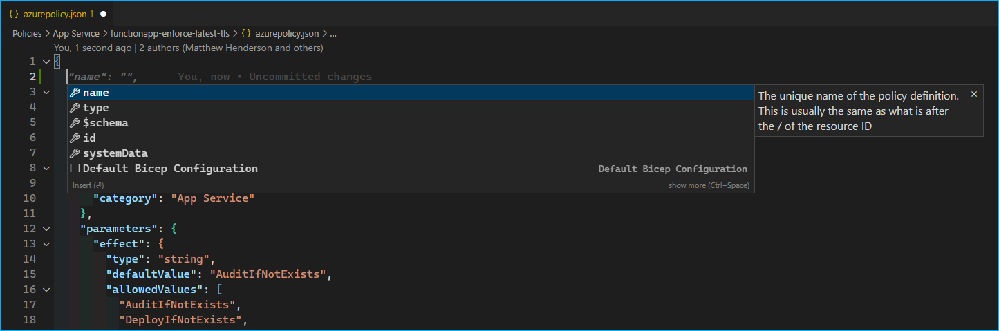

# Azure Policy Editor Schema

Microsoft, for some reason, does not appear to provide a schema except for the Policy rule definition, which makes doing
Azure Policy-as-Code difficult to work with if you don't have proper intellisense and validation in your editor.

The JSON schemas in this repository take the [Azure Policy Definition Structure](https://docs.microsoft.com/en-us/azure/governance/policy/concepts/definition-structure)
and codify them into JSON Schemas.

## VSCode Extension

The VSCode extension basically just adds automatic schema validation for files that follow the [Azure Policy as Code](https://docs.microsoft.com/en-us/azure/governance/policy/concepts/policy-as-code)
model. To specify your own file format, copy the `jsonValidation` key from the [package.json](./package.json) and paste it into
either your user or workspace settings, and modify the fileMatch appropriately. [More info about schema mapping is here](
  https://code.visualstudio.com/docs/languages/json#_mapping-in-the-json
)

## Simple VSCode Extension Demo

1. Start VSCode and clone the Azure/Community-Policy Github repository or go to https://github.dev/Azure/Community-Policy
1. Search for `azure-policy-intellisense` in the extensions window and install it.
1. Open an `azurepolicy.json` file and you should be able to get intellisense for properties and values.

